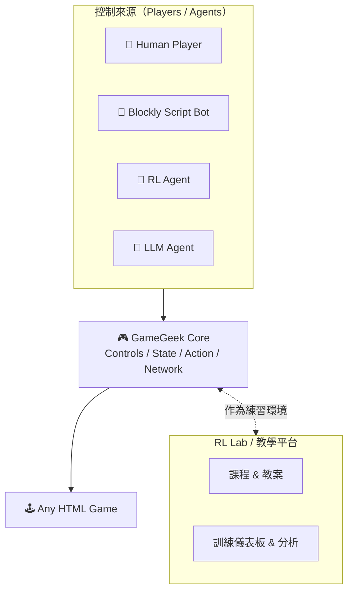

# 🎮 GameGeek（GG）Roadmap & 商業定位
LeafLune Edutainment Studio｜2025

GameGeek（簡稱 GG）是一個跨遊戲、跨 AI、跨腳本的通用遊戲介面（Universal Game Interface）。  
它不只是操作殼，也不是單一遊戲，而是一整套 **遊戲 + AI + 教學** 的技術平台。

---

# 🌕 GG 四階段發展目標

## 🥇 Phase 1：遊戲控制殼（Game Shell）
**定位：共用、漂亮、直覺的 Web 遊戲主機 UI**

- 左邊控制器（D-pad）  
- 右邊功能鍵（1–4）  
- Start / Menu / 設定按鈕  
- 直/橫版自適應  
- 中央遊戲 iframe  
- 所有遊戲只需實作 `receiveAction(action)` 即可被控制

**成果：**
- 完全統一控制邏輯
- 任何遊戲上架在 GG，介面立即一致
- 形成 LeafLune 的獨特「遊戲主機感」

---

## 🥈 Phase 2：AI 控制介面（AI Agent Integration）
**定位：讓人類、RL、LLM 都能控制 GG**

GG 成為「遊戲的中介」，提供標準化協定：

- `state` 遊戲 → GG  
- `action` GG → 遊戲  
- `reward` 遊戲 → GG  

可掛載：

- 🧠 RL Agent（Q-learning / DQN / PPO…）  
- 🤖 LLM Agent（Groq / GPT 等低頻決策）  
- 📜 腳本 Agent  
- 👤 人類玩家  

**成果：**
- GG 正式變成「AI-friendly 遊戲主機」
- 適用於 RL 教學、生態系擴展、AI demo

---

## 🥉 Phase 3：Blockly 腳本系統（GG Script）
**定位：人類編程 + 狀態處理 + 規則 AI 的工作區**

內建 Blockly 讓使用者能：

- 編寫自動化腳本  
- 產生 macro 行為  
- 將 raw state 做特徵工程（state preprocessing）  
- 視覺化 agent 的決策流程  
- 快速做 rule-based AI player  

**成果：**
- GG 成為「AI / 腳本 / 人類共存」的平台  
- 讓非工程背景的人也能製作 bot  
- 讓 RL + LLM 有捕捉規則的藍本

---

## 🏆 Phase 4：WebRTC 連線大廳（GG Online）
**定位：所有 GG 遊戲共用的多人連線系統**

提供跨所有遊戲的：

- 房間建立 / 加入（Lobby）  
- WebRTC P2P 傳輸  
- 玩家列表 / 匹配系統  
- 觀戰模式  
- AI 對戰、人類 vs AI、AI vs AI  
- 無需每個遊戲重寫連線功能

**成果：**
- GG 變成可多人遊玩、可教學、可競賽的平台
- 成為 LeafLune 旗下所有遊戲的「連線標準」

---

# 🌐 最終形態：GameGeek = Game Gateway

GG 完成四階段後，將具備：

- 多種控制來源（人類、RL、LLM、腳本）  
- 統一的控制總線（Controls / State / Action / Network）  
- 可插拔的遊戲環境（任何支援協定的 HTML 遊戲）  
- 作為 RL Lab / 教學平台的實驗場與展示舞台  

---

# 💰 商業定位：GG 免費、RL Lab 收費

## 🎣 GG = 引流產品（免費）
適合作為：

- itch.io 上的免費遊戲合集  
- LeafLune 官網的互動展示  
- 學生、老師免費試玩  
- AI 控制遊戲的 Demo 入口  
- 團隊技術形象的展示窗口  

**特性：**

- 好玩  
- 美觀  
- 低門檻  
- 容易分享  
- 像一台屬於 LeafLune 的「Web 遊戲主機」

➡️ **免費讓更多人接觸 LeafLune 生態系。**

---

## 💼 RL Lab = 主力付費產品（訂閱制 / 校園授權）
GG 作為底層技術，支撐 RL Lab 的高價值內容：

- RL 教學平台（Blockly + 模擬 + 圖表）  
- 完整課程 / 教案 / 練習題  
- 自動訓練 AI 的環境  
- 老師與學校願意付費的功能  
- 課程可直接納入正式教材  

**自然的收費方式：**

- 月費 / 季費 / 年付  
- 校園授權  
- 營隊課程授權  
- 進階版（含 GG Script / GG Online）  

➡️ **GG 是免費入口，RL Lab 是真正收費產品。**

---

# 📌 Summary

**GameGeek 是免費的「遊戲 + AI 介面生態平台」，  
RL Lab 是基於 GG 的「專業 AI 教學平台」，  
GG 讓大家進來玩，RL Lab 讓你真正賺錢。**
